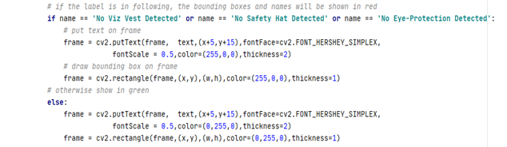
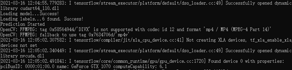

# Object Detection with Custom Vision and OpenCV
You will build an object detector with the Azure Custom Vision, if you do not have an Azure subscription please
create a free account before you begin.

Please visit: https://www.customvision.ai/

# Test trained model on video with OpenCV
You will learn how to use trained model to run prediction on video with OpenCV. 
The trained model is downloaded from Custom Vision webpage in a docker format, 
and bounding boxes will be draw on each frame of a video and saved to a .mp4 format. 

Step 1. In the Custom Vision webpage, go to <b>Performance</b> tag on the top

Step 2. Click the <b>Export</b> and choose the Dockerfile with either Linux or Windows platform

Step 3. Click <b>Export</b>, and when its ready click <b>Download</b>.

Step 4. Extract the zip file that downloaded from Custom Vision and go to app folder, 
copy <b>model.pb</b> and <b>labels.txt</b> to replace existing files

Step 5. Go to predict_on_video.py, on the line 56 you could put class labels here to customize their color.
For example, No Viz Vest Detected, No Safety Hat Detected and No Eye-Protection Detected will 
be showing red for the bounding boxes, label, and probability on the video. Other class labels will be showing in green.  

Step 6. Run pip install -r requirements.txt

Step 7. After all dependencies installed, you need to run python file via command line. 
Please see below syntax for command and its parameters.

python predict_on_video.py --input_path <your video path> --output_path <video output path> 
--image_size <your desired image size, default is 768> --iou_threshold<float> 
–-pro_threshold<float>

Parameters:
--input_path: file path to your video.
(default: ./video/video2.mp4)

--output_path: file path to save your video when prediction finished. default(./output/videos/output_video_{$ui}.mp4)

--image_size:size for each frame from video to be predicted from model, as well as for the output video.
(default: 768)

--iou_threshold: overlap between the predicted object bounding box. 
(default: 0.3)

--pro_threshold: level of confidence that a prediction needs to have in order to be considered correct.
(default: 0.3)

e.g:

        python predict_on_video.py --input_path ./video/video4.mp4 --output_path ./output/videos/draft_video_3030_v4_iter13.mp4
        --iou_threshold 0.3 –-pro_threshold 0.3
        
If successful you will see following output and a video will show up to display.   

